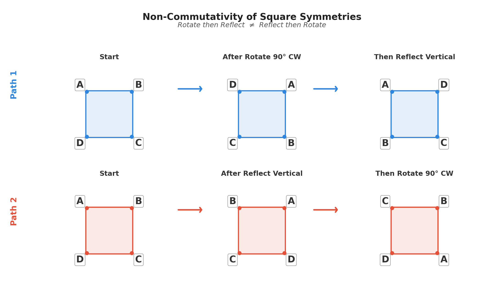

## Introduction
Group field theory is a beautiful mathematical idea: that the whole of the universe emerges from the interplay of symmetries. We will begin with the simplest possible foundation: defining a set of symmetries, and then building a universe out of them. This is the playground, where we set up a series of simple rules, and then see what happens when we let them run.

The 'group' in 'group field theory' refers to a mathematical structure that captures the idea of symmetry. A group is a set of elements, along with an operation that combines two elements to produce a third. These elements represent symmetries, and the operation represents how these symmetries combine. For example, the symmetries of a square can be represented by a group consisting of rotations (by 90, 180, and 270 degrees), reflections in both the horizontal and vertical axes and through the corners, and the identity transformation (doing nothing). These symmetries can be combined in various ways: for example, a 90 degree rotation followed by a reflection across the vertical axis is equivalent to a reflection across the diagonal. The group captures all of these relationships between symmetries. 

The symmetries of a square also include an important concept in group field theory: they are not commutative. This means that order in which you carry out the symmetry operations is important. For example, if you first rotate the square by 90 degrees and then reflect it across the vertical axis, you will end up in a different position than if you first reflect it and then rotate it. This non-commutativity is a key feature of the symmetries that we will be working with in group field theory, and it leads to rich and complex behavior when we start to combine these symmetries in various ways.

## The group {#sec-thegroup}

Let us introduce the group that we will be using to build our universe. It is a relatively complicated group, so once we have introduced it we will break it down and explain what each component means. The group is 

$$
G=\mathrm{SO}(4,1)\times \mathrm{U}(1) \times \mathrm{SU}(2) \times \mathrm{SU}(3).
$$ {#eq-thegroup}

Let's break it down. The first part, $\mathrm{SO}(4,1)$, is the group of symmetries of a four-dimensional spacetime with one time dimension and three spatial dimensions. The second part, $\mathrm{U}(1)$, is the group of symmetries associated with electromagnetism. The third part, $\mathrm{SU}(2)$, is the group of symmetries associated with the weak nuclear force. The fourth part, $\mathrm{SU}(3)$, is the group of symmetries associated with the strong nuclear force. We have chosen this group based on observations of our universe: it was a specific choice that we made in order to build a universe that resembles our own. However, we could have chosen a different group, and we would have ended up with a different universe. This is the playground: we can choose any group we like, and then see what kind of universe emerges from it.

@eq-thegroup is a special type of group called a semisimple Lie group. This gives it some very nice mathematical properties that we will be using to create our universe. In particular, Lie groups have a corresponding Lie algebra, which is a mathematical structure that captures the infinitesimal symmetries of the group. The Lie algebra allows us to work with the symmetries in a more manageable way, and it will be a key tool in our construction of the universe. Each element of a Lie group $G$ can be expressed as the exponential of an element of its Lie algebra $\mathfrak{g}$, which is a very powerful property to help us analyse the group. As the group @eq-thegroup is a direct product of four underlying groups, the algebra is a direct sum of the underlying algebras (compare to how normal exponentials work: $e^{a+b}=e^a e^b$),

$$
\mathfrak{g}=\mathfrak{so}(4,1)\oplus \mathfrak{u}(1) \oplus \mathfrak{su}(2) \oplus \mathfrak{su}(3).
$${#eq-thealgebra}

Each of these algebras is formed of a set of 'generators', which are the building blocks of the symmetries. The generators of $\mathfrak{so}(4,1)$ are denoted by $M_{AB}$, where $A$ and $B$ run from 0 to 4. The generators combine together through a set of rules called the commutation relations, which capture how much the symmetries fail to commute. A commutator is defined simply as $[X, Y] = XY - YX$. The commutation relations for $\mathfrak{so}(4,1)$ are given by

$$
\left[M_{AB}, M_{CD}\right] = \left(\eta_{AC} M_{BD} - \eta_{AD} M_{BC} - \eta_{BC} M_{AD} + \eta_{BD} M_{AC}\right),
$${#eq-so41commutation}

where $\eta_{AB}=\mathrm{diag}(-1,1,1,1,1)$. This looks a lot like the metric of special relativity, just with an extra spatial dimension: this will turn out not to be a coincidence!

$\mathfrak{u}(1)$ only has a single generator, which we will denote by $Q$. The commutation relations for $\mathfrak{u}(1)$ are trivial: $[Q, Q] = 0$ (because there is only one generator, and a generator always commutes with itself). An algebra where all generators commute is called 'abelian'.

$\mathfrak{su}(2)$ has three generators, which we will denote by $J_i$ where $i$ runs from 1 to 3. The commutation relations for $\mathfrak{su}(2)$ are given by

$$
\left[J_i, J_j\right] = i \epsilon_{ijk} J_k
$$ {#eq-su2commutation}

where $\epsilon_{ijk}$ is the Levi-Civita symbol, which is defined as $\epsilon_{123} = 1$ and is antisymmetric in its indices (i.e. $\epsilon_{ijk} = -\epsilon_{jik}$, and $\epsilon_{iij} = 0$). As not all commutation relations are zero the algebra $\mathfrak{su}(2)$ is non-abelian. The commutation relations for $\mathfrak{su}(3)$ are more complicated, but they have a similar structure to those of $\mathfrak{su}(2)$, built from generators $T_a$ where $a$ runs from 1 to 8.

## Casimir invariants {#sec-casimirs}

A very important concept in group field theory is that of Casimir invariants. A Casimir invariant is a quantity that is constructed from the generators of the algebra, and that commutes with all of the generators. This means that it is a quantity that is conserved under the symmetries of the group. For example, for $\mathfrak{so}(4,1)$ there are two Casimir invariants. The first is given by

$$
\mathcal{C}_2^{\mathfrak{so}(4,1)} = \frac{1}{2} \eta^{AC} \eta^{BD} M_{AB} M_{CD},
$$ {#eq-so41casimir2}

and the second is formed using the Levi-Civita symbol again as

$$
\begin{aligned}
W^A &= \frac{1}{8} \epsilon^{ABCDE} M_{BC} M_{DE},\\
\mathcal{C}_4^{\mathfrak{so}(4,1)} &= \eta_{AB} W^A W^B.
\end{aligned}
$$ {#eq-so41casimir4}

Next time we will investigate the physical meaning of these Casimir invariants. But let us finish this post with the Casimir invariants for the other algebras. For $\mathfrak{u}(1)$ there is only one Casimir invariant, which is simply $\mathcal{C}_2^{\mathfrak{u}(1)} =Q^2$. For $\mathfrak{su}(2)$ there is also only one Casimir invariant, which is given by $\mathcal{C}_2^{\mathfrak{su}(2)} = J_i J_i$. $\mathfrak{su}(3)$ is again a bit more complicated: it has two Casimir invariants, which are given by

$$
\begin{aligned}
\mathcal{C}_2^{\mathfrak{su}(3)} &= T_a T_a,\\
\mathcal{C}_3^{\mathfrak{su}(3)} &= d_{abc} T_a T_b T_c,
\end{aligned}
$$ {#eq-su3casimirs}

where the symmetric invariant tensor $d_{abc}=\frac{1}{4} \mathrm{Tr}(\{T_a, T_b\} T_c)$. The Casimir invariants are very important because they will turn out to be related to the physical properties of the particles in our universe. For example, the Casimir invariant $\mathcal{C}_2^{\mathfrak{so}(4,1)}$ will turn out to be related to the mass of particles, while $\mathcal{C}_2^{\mathfrak{su}(2)}$ will be related to the weak isospin of particles. We will dive into this correspondence between Casimir invariants and physical properties in the next post.